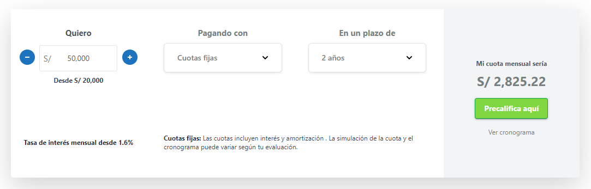

=== WP Calc-Financiera ===
Contributors: rickmaster2008
<!-- Donate link: https://portafolio.cotillo.tech -->
<!-- Tags: comments, spam -->
Requires at least: 5.0.0
Tested up to: 5.7
Stable tag: stable
License: GPLv2 or later
License URI: http://www.gnu.org/licenses/gpl-2.0.html

Calculadora financiera que permite al usuario calcular cuota de préstamo, monto futuro de inversión o factoring

<!-- == Description ==

This is the long description.  No limit, and you can use Markdown (as well as in the following sections).

For backwards compatibility, if this section is missing, the full length of the short description will be used, and
Markdown parsed.

A few notes about the sections above:

*   "Contributors" is a comma separated list of wp.org/wp-plugins.org usernames
*   "Tags" is a comma separated list of tags that apply to the plugin
*   "Requires at least" is the lowest version that the plugin will work on
*   "Tested up to" is the highest version that you've *successfully used to test the plugin*. Note that it might work on
higher versions... this is just the highest one you've verified.
*   Stable tag should indicate the Subversion "tag" of the latest stable version, or "trunk," if you use `/trunk/` for
stable.

    Note that the `readme.txt` of the stable tag is the one that is considered the defining one for the plugin, so
if the `/trunk/readme.txt` file says that the stable tag is `4.3`, then it is `/tags/4.3/readme.txt` that'll be used
for displaying information about the plugin.  In this situation, the only thing considered from the trunk `readme.txt`
is the stable tag pointer.  Thus, if you develop in trunk, you can update the trunk `readme.txt` to reflect changes in
your in-development version, without having that information incorrectly disclosed about the current stable version
that lacks those changes -- as long as the trunk's `readme.txt` points to the correct stable tag.

    If no stable tag is provided, it is assumed that trunk is stable, but you should specify "trunk" if that's where
you put the stable version, in order to eliminate any doubt. -->

== Installation ==

This section describes how to install the plugin and get it working.

1. Descargar el zip de la rama stable. 
1. Sube el zip en la sección plugins de tu página de WordPress
1. Activa el plugin

== Como usar ==

1. Utiliza el shortcode `[calculadora-prestamo]` o `[calculadora-inversion]`.

1. Attributos de `[calculadora-inversion]`:
    * dirección - string - (default: horizontal)
    * cuotas_fijas_tea - float (default: 0.36)
    * solo_intereses_tasa - float (default: 0.025)
	* prestamo_puente_tasa - float (default: 0.032)

    Ejemplo: `[calculadora-prestamo direccion=horizontal cuotas_fijas_tea=0.40 solo_intereses_tasa=0.035 prestamo_puente_tasa=0.022]`

    
1. Atributos de `[calculadora-inversion]`
    * dirección - string (default: horizontal)
    * prestamo_tea - float (default: 0.36)
    * factoring_tea - float (default: 0.39)

    Ejemplo:  `[calculadora-inversion direccion=vertical prestamo_tea=0.25 factoring_tea=0.45]`

    

1. Las solicitudes se guardarán en el Post Type **Solicitud**

1. Puedes **Exportar** las solicitudes en un archivo excel escogiendo el rango de fechas y dando click al botón **Exportar**

    
